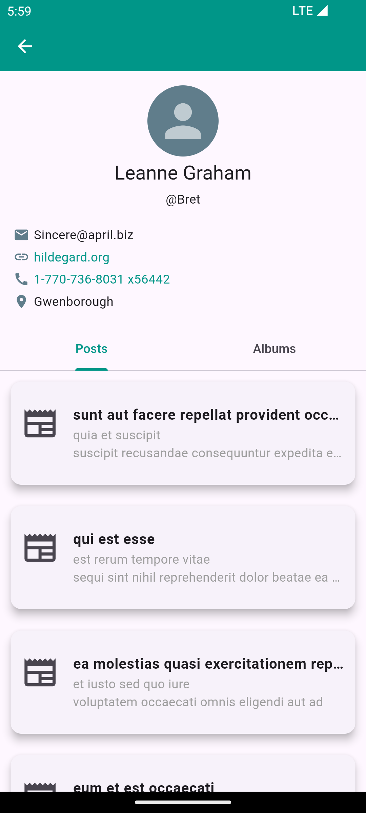

# techjar_task_rujeet

This is the task for TechJar by Rujeet Prajapati. This project has been completed by using flutter. 

## Key Things to Know about this Project

- Clean code architecture has been used in this project.
- For state management, bloc(business logic component) is used.
- Various widgets have been for reusability.
- Proper naming conventions have been followed for file names as well as class names and function names.
- Extra tasks such as albums, users and photos are included.
- Flutter cache manager is a third party package used for data persistence.

## Page Details

1. Post Page

- This is the first page of the app where list of posts from the given api is fetched and displayed.

2. Post Detail Page

- After tapping on the post tile in post page, user is navigated to this page with more details about specific post along with comment section and author information.

3. User Profile Page

- User can view the detail of the author by clicking on author button on post detail page. Here is the information of an author who posted the specific post. Also, user specific posts and albums are displayed on this page in tab view.

4. Album Page

- In this page photos in the specific albums are displayed in grid view.

